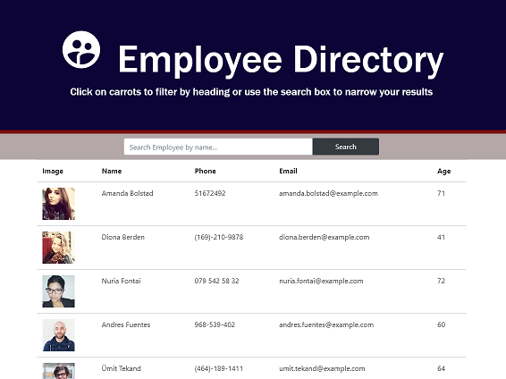

# Unit 19 React Homework: Employee Directory

## Description

A employee directory with React. A user, I want to be able to view my entire employee directory at once so that I have quick access to their information.

Offline Functionality:

  * Enter deposits offline

  * Enter expenses offline
____

##  Applications Uses in this projects
    * Node.js
    * React.js
    * Bootstrat
    * Axios

## Instalation 

        $ npx create-react-app .
        $ npm install axios
       
## Pages  view


# Links to Project

#### GitHub
 [GitHub repository](https://github.com/RumaRDas/react_employee_directory.git.)

### Run Server

```bash
$ npm start
```

